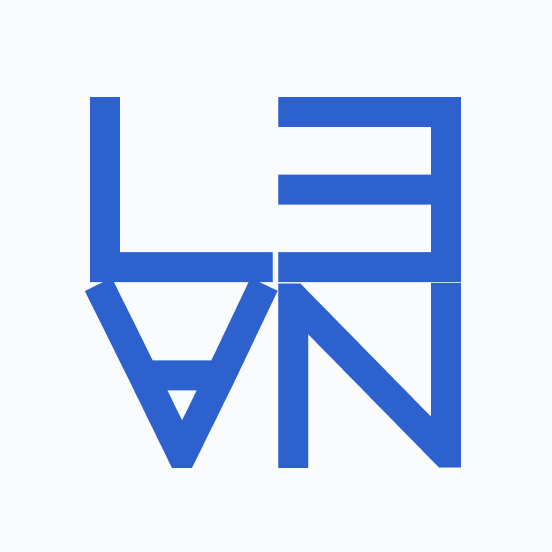
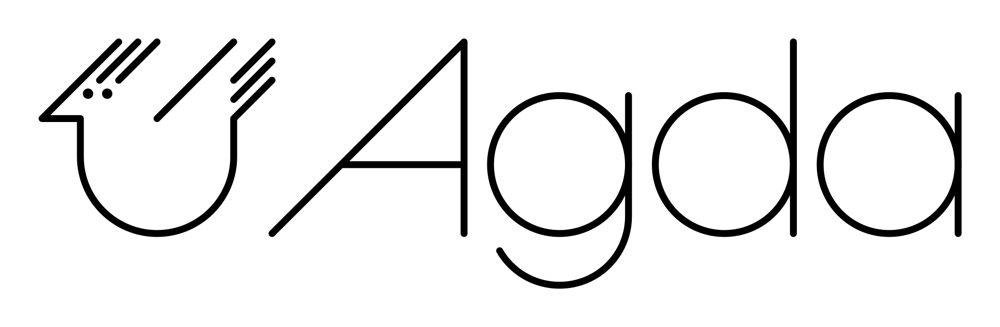

<div align="center">

# Theoremata

**A graph-first agentic harness for mathematics. It falsifies conjectures before proving them, re-checks every proof through a kernel, and emits independently checkable certificates.**


</div>

Theoremata is an environment for doing mathematics with a language model in the
loop. The model proposes; a formal proof assistant decides. A Rust core drives a
typed proof-DAG and an orchestration loop. A set of deterministic Python workers
do the mechanical work: falsification, retrieval, grading, training, and exact
certificate checking. Six proof assistants (Lean 4, Rocq, Isabelle/HOL, Candle,
Agda, Metamath) each verify proofs through one layered gate. Every claim the
system accepts is one a kernel re-checked, and many results also carry a
self-describing certificate that a separate checker can re-verify offline.

It began as a Lean-only vertical slice and grew into a harness that spans six
proof assistants, an informal-sketch-to-formal-proof pipeline, a growing
verified-lemma library, a self-improvement flywheel, and a library of exact
proof certificates. Each piece was adopted from the open-source and published
theorem-proving literature (mined under `docs/`) and wired around one rule: the
verifier is ground truth.

## About

The hard part of machine mathematics is not writing a proof. It is trusting one.
A model that emits fluent Lean can still emit a proof that uses `sorry`, admits an
axiom it should not, or type-checks a statement that drifted from the theorem you
asked about. Theoremata treats generation as cheap and untrusted, and makes
verification the authoritative step. Search, memory, retrieval, learning, and
evaluation all hang off that.

Three rules run through the whole system:

- **Falsify before you prove.** Before a conjecture is worth proving, the system
  tries to break it with an executable counter-search or numeric falsifier. A
  claim that survives is worth formal effort. One that does not is rejected with a
  concrete counterexample.
- **A proof is only as good as its kernel re-check.** Compiling is not enough.
  Every accepted proof passes a 3+1-layer gate: compile, audit the axioms and
  oracles it used against a whitelist, re-check it through the kernel, then scan
  the source for the escape hatches the first three layers cannot see.
- **A certificate should be re-checkable by someone who does not trust you.** For
  the results that admit one (linear and nonlinear bounds, primality, ideal
  membership, real-root counts, and more), the system emits a self-describing
  proof-log that a small, independent checker re-verifies from the raw numbers
  with exact arithmetic.

The system prefers to abstain or report "unverifiable" over certifying something
it cannot stand behind. A mock or offline check can never mark a result formally
verified; only a live prover run can.

## The verification gate

Every formal system plugs into one gate (`components/prover/formal.rs`), so which
prover you use is a configuration choice rather than a rewrite. The gate is the
same four layers for all six systems:

| Layer | What it does |
|-------|--------------|
| **1. Compile** | The proof elaborates and type-checks in the target system. Success is read from a per-backend signal it declares (an honest non-zero exit, or a required-plus-forbidden stdout sentinel), never from the exit code alone. |
| **2. Axiom / oracle audit** | The axioms and oracles the proof depends on are inside a per-system whitelist; anything else fails closed. |
| **3. Kernel re-check** | An independent kernel re-validates the term (a smaller trusted checker, or for Candle a machine-proven kernel). |
| **4. Source scan** | The source is scanned for the escape hatches the first three layers cannot see, and the submitted proof is confirmed to declare the requested statement (not a weakened or different one). |

Layer 4 is not optional. Several soundness escapes evade both the axiom audit and
the kernel re-check, so the source is always scanned, and the statement the proof
actually proves is checked against the statement that was asked. See
[`docs/formal-systems/`](docs/formal-systems/) for the full trust model.

A compiler's exit code is never trusted on its own. Each backend declares how it
signals success (a non-zero exit that is honest, or a required stdout sentinel
plus a forbidden one), because a checker that reports success by exit status
alone can be made to pass a proof it did not accept. Every system also carries a
`FoundationProfile` recording its logical foundation and trusted base, so the
gate reasons about what it is actually trusting rather than treating all six
alike.

That exit-code discipline is one of several mechanisms adopted from the
[Higher Order Co ecosystem audit](docs/resource-mining/new/higher-order-co.md).
The dependency itself (HVM / Bend / Kind) was evaluated as a possible backend and
deliberately NOT adopted, for licensing and because it could not enter the
trusted path; three of its ecosystem's systems return exit 0 even on failure,
which is where the discipline above came from. What was worth keeping is the
ideas, not the code: the per-backend success signal, a hash-consed "share rather
than recompute" cache of already-verified subproofs (the sound form of HVM's
sharing principle), an inline search-priority nudge on the proof frontier (the
shape of HVM3's `CInc`/`CDec`), and advisory Agda `--interaction-json`
diagnostics kept strictly separate from the pass/fail verdict. See
[`docs/build-plan-hoc.md`](docs/build-plan-hoc.md) for the item-by-item plan.

### The six formal systems

| System | Foundation | Compile / check | Escape hatches the gate rejects |
|--------|------------|-----------------|---------------------------------|
| **Lean 4** | Calculus of Inductive Constructions | `lean`, re-check `leanchecker` | `sorry`, disallowed axioms, `native_decide`-style trust holes |
| **Rocq (Coq)** | Calculus of Inductive Constructions | `coqc`, re-check `coqchk` | `Admitted`, `-type-in-type`, `Unset Universe Checking` |
| **Isabelle/HOL** | Church higher-order logic | `isabelle build`, oracle audit | non-empty oracle set, `sorry` |
| **Candle** | HOL Light (machine-proven kernel on CakeML) | `candle`, the kernel is the proven check | `mk_thm`, `new_axiom`, `CHEAT_TAC`, undue axioms outside `ETA_AX`/`SELECT_AX`/`INFINITY_AX` |
| **Agda** | Martin-Lof dependent type theory | `agda --safe` | `postulate`, `--allow-unsolved-metas`, foreign-compilation pragmas |
| **Metamath** | Metamath substitution kernel over set.mm | `verify proof *` | generated `$a` axioms, `?` placeholder proof steps, includes that escape the workspace |

Candle is distinguished among the six: its kernel's soundness is machine-proven
in HOL4 down to the CakeML-compiled binary, so its layer-3 re-check carries a
stronger guarantee than a smaller-trusted-checker. Its axiom auditor
(`components/prover/axiom_audit.rs`) enforces HOL Light's exact three-axiom base
and flags the real forgery routes (`mk_thm`, `new_axiom`, `CHEAT_TAC`, unsound
definitional extensions).

## Verified certificates (cert-log)

Beyond the kernel gate, Theoremata carries a self-describing certificate
proof-log format (`theoremata.cert-log.v1`) and a family of small, independent
reference checkers that re-verify a certificate from its raw rationals with exact
arithmetic, trusting nothing from the producer. The design follows the
search-anywhere, check-in-kernel philosophy: an untrusted engine (often SymPy, or
an external LP or SDP solver) finds the certificate, and a pure checker is the
sole trust boundary. Fourteen certificate kinds ship, each with a tamper-rejecting
checker:

| Kind | Certifies | Checker basis |
|------|-----------|---------------|
| `lp_primal_dual`, `lp_farkas`, `flyspeck_lp` | linear bounds / infeasibility (incl. the Flyspeck modified-dual trick) | exact rational Farkas combination |
| `positivstellensatz`, `sos` | nonlinear infeasibility / polynomial nonnegativity | exact SOS Gram (LDL^T) test |
| `bernstein`, `taylor_model`, `bnb_inequality` | polynomial and analytic nonlinear bounds over a box | Bernstein convex-hull, `mpmath.iv` intervals, branch-and-bound tree |
| `sturm` (+ `poly_minimax`) | exact real-root counts and minimax approximation bounds | Sturm chain re-derivation |
| `nullstellensatz`, `wz` | ideal membership; hypergeometric identities | cofactor re-expansion; WZ telescoping |
| `pratt_primality`, `pocklington_primality` | primality | recursive modular-exponentiation witness |
| `bezout`, `continued_fraction`, `herbrand` | gcd cofactors; Diophantine hardness; first-order validity via ground instances | exact integer / propositional re-decision |
| `wu_geometry`, `asymptotic`, `subsumption` | geometric pseudo-remainders; log-linear asymptotics; clause subsumption | exact re-evaluation |

Every checker is pure, offline, and deterministic. Where a certificate needs
heavy search to find (multivariate SOS needs an SDP solver, primality needs
factoring), that generation step is a documented, gated seam; the checker itself
always runs offline. A HOL Light or CakeML-verified checker validating the same
log is the toolchain-gated upgrade.

### Untrusted oracles (Wolfram)

That generator/checker split is what lets a closed, proprietary system be useful
here without being trusted. A Wolfram Engine, when one is configured, is used to
FIND objects our own checkers then verify: SOS and Positivstellensatz multipliers,
Nullstellensatz cofactors, real-root counts, counterexamples, and integer
relations. Wolfram cannot enter the gate, for four independent reasons: its
kernel is closed and cannot be re-checked, it is not proof-producing, it makes
silent generic assumptions (the unaccounted-hypothesis mode the gate's hypothesis
audit exists to catch), and its free licence is development-only.

So the boundary is enforced in code rather than by convention:

- A generated certificate is passed through the corresponding existing checker
  **before it is returned**, and exactly one function is able to populate the
  certificate field, only on the checker's acceptance. No branch can emit an
  unchecked certificate.
- A proposed counterexample is re-verified in exact rational arithmetic against
  the original claim before it counts as a refutation. A witness we cannot
  independently confirm is discarded.
- The falsification vocabulary contains no positive verdict at all. Wolfram
  finding nothing is not evidence of anything, and there is deliberately no word
  available to say otherwise.
- Wolfram|Alpha additionally interprets natural language before computing, so
  every result carries the assumptions it made. A silently reinterpreted question
  is the same statement-drift failure the gate's statement-preservation layer
  catches, so an answer is never separated from the reading it answered.

Both transports (a local `wolframscript`, or the HTTP computation API) are
opt-in, report which one produced a result, and degrade to a clean "unavailable"
that is kept distinct from "we looked and found nothing". See
[`docs/resource-mining/new/wolfram.md`](docs/resource-mining/new/wolfram.md) for
the full evaluation of the ecosystem, including what was rejected and why.

## Features

**Formal verification (six systems)**

- Lean 4, Rocq, Isabelle/HOL, Candle (verified HOL Light on CakeML), Agda, and
  Metamath behind one `FormalSystem` / `FormalBackend` / `ProofSession`
  abstraction, each running the full 3+1 gate.
- A runner-agnostic exec bridge with fail-closed resource limits (a wall-clock
  timeout and output cap on every external check, so a pathological proof cannot
  hang or flood the harness). Any system can run native, in WSL, or in Docker by
  setting a config key, with no code change.
- Portfolio proving: attempt a conjecture across systems and take whichever
  certifies first.
- Hammer-assisted proving: Sledgehammer, CoqHammer, and aesop can find a tactic,
  which is then assembled into a native proof and verified through the same gate,
  with no model in the loop.
- Trust hardening: a mock or toolchain-absent check downgrades to
  `InformallyVerified` and can never yield `FormallyVerified`; the API cannot set
  the verified status by fiat; graph mutations are transactional.
- Statement screening before a new statement enters the graph: a multi-sample
  model judge and a negation prover (the falsifier proving the negation) vote on
  whether a proposed statement is well-formed and non-trivial, and the screen
  fails closed, so an errored or absent verdict never reads as a pass.
- A vacuity guard against proofs that discharge a goal by making the hypotheses
  contradictory: a bounded numeric searcher constructs and checks a satisfiability
  witness for a decidable fragment, and both "found nothing in bounds" and
  "outside the fragment" collapse to no-witness so the guard cannot be talked into
  a pass by a search it never actually ran.
- A hypothesis-discharge audit for assumptions that are invisible to `#print
  axioms` and to a `sorry` grep: Prop-valued arguments and uninhabited
  assumption-bundling structures that would otherwise let a proof quietly carry an
  unaccounted hypothesis.
- Async external-prover jobs (submit, sparse-poll, resume, cancel) with per-attempt
  artifact directories, so a long remote proof run is checkpointed rather than
  held open, and adapters for tactic-session and retrieval-augmented backends
  (LeanDojo-style, ReProver-style, Aristotle) behind the same contract.

**Search and proving**

- A Monte-Carlo graph search driver whose transposition table collapses
  equivalent subgoals into one node, an injectable trained-critic seam, an
  adaptive per-node expansion budget, and a test-time-compute controller that
  spends search budget as a function of goal difficulty.
- A value-free best-first search, a goal-directed model-elimination / connection
  tableau prover, and a hybrid router that runs both because they cover disjoint
  proof space.
- Additional search calculi that report candidates rather than proofs: an
  inverse-method forward-saturation prover and a speculative ensemble search that
  reuses one tree's proven fact across its siblings by subsumption. Every outcome
  they emit is branded unverified and recorded as evidence, never as a closed
  node, so a search hit can never be mistaken for a checked proof.
- Negation-augmented search where a disproof competes for the same budget, AND/OR
  minimax selection, empirical sampled-action priors, and symmetry-orbit dedup.
- An inline priority nudge the generator can emit alongside a tactic (the shape of
  HVM3's `CInc`/`CDec`), folded into the frontier ordering so a producer's own
  confidence steers the search without overriding the scorer.
- A verification ladder that makes falsify-before-prove general: an ordered cost
  hierarchy (`fast_refute` to `cheap_decide` to `expensive_kernel`) where numeric
  spot checks, property testing, SMT probes, and the real kernel are all injected
  rungs of one control flow, so the kernel is paid for only when a cheap check
  could not settle the question.
- A scored proof pool that keeps each candidate's verifier score, self-eval, and
  `dep_proof_ids` lineage, so a refined proof records which candidate it came
  from, and certification is routed through the pool plus meta-verification
  rather than trusting a single sample.
- Dense per-step process supervision: one terminal correctness bit from the
  formal gate is turned into MCTS-Q per-step reward, which is what trains the
  critic half of the flywheel.
- First-order term rewriting primitives: true unification with occurs-check,
  LPO/KBO term orderings, and bounded Knuth-Bendix completion.
- An informal-sketch to autoformalize-holes to splice pipeline: decompose a proof
  sketch into a sub-DAG of obligations, prove each hole, reassemble, and refuse
  assembly unless every hole closes; with reflective re-decomposition and
  self-summarizing restarts on failure.
- A conjecture-and-prove engine that proposes conjectures, falsifies then proves
  the survivors, and graduates the proved ones into the lemma library. Each
  proposed batch is deduplicated before any prover effort is spent, so two
  conjectures that are the same statement are never both attempted.
- Failed-attempt feedback that turns a rejected proof into structured next steps:
  the checker diagnostics are rendered with corrected source spans, the explicit
  holes and error positions are lifted out as unproved obligations, an
  `unknown identifier` is resolved against a declaration index that separates
  "no such name" (abandon it) from "real but unimported" (add this import), and
  when a warm Lean REPL is running, the actual goal state at the error is
  recovered from the elaboration infotree and attached to the feedback. Agda has
  the parallel path: `--interaction-json` goals and errors are parsed as advisory
  enrichment, deliberately kept out of the `agda --safe` pass/fail verdict so the
  richer feedback can never soften the gate. The lifted obligations always enter
  the graph unproved; a failed compile is never read as evidence that any of them
  holds.
- Proof minimization: a solved tactic sequence is shrunk to a shorter one that is
  RE-CHECKED against the gate, never merely guessed. A shrink is accepted only
  when it still verifies; otherwise the original stands. The re-check is a real
  one: the candidate sequence is assembled under the original statement and run
  through the full 3+1-layer gate, and it fails closed on every other outcome, so
  a mock backend, an absent toolchain, or a checker error all decline the shrink
  rather than confirm it. Notably it is NOT built on per-tactic stepping, because
  the current session backends decide "did this close the goal" lexically from the
  tactic text, which would let the substring `trivial` certify any shrink.
- Blueprint and paper-scale runs: drive a whole multi-lemma `leanblueprint`
  `content.tex` end to end, proving dependencies before dependents, with
  content-addressed theorem import for tamper-evident reassembly.

**Memory and reuse**

- A typed proof-DAG (SQLite/WAL, transactional mutations) with three-valued taint
  provenance: clean, tainted, self-admitted.
- A growing verified-lemma library with an evolver. Solved sub-lemmas become
  reusable skills, generalized along several axes and admitted only through the
  gate.
- A global goal cache that reuses proofs across runs via subsumption, so a proof
  of a more-general goal discharges a more-specific one.
- A hash-consed checker-result cache: once a sub-goal has cleared the gate, its
  verdict is memoized on the full verification input (system, canonical statement,
  ordered context, exact source, checker identity, gate policy) and not
  re-verified across candidates that share it. This is the sound form of "share
  rather than recompute": a verdict is reused only when every one of those fields
  matches, so caching never launders a result across a changed premise or policy.

**Retrieval**

- Premise retrieval over each system's corpus (Lean Loogle-style, Rocq `Search`,
  Isabelle `find_theorems`) behind one contract.
- A BM25, dense, and LM-reranker cascade, plus error-identifier-keyed retrieval
  that queries on the exact unresolved names a failed proof needs, and query
  rewriting that expands one goal into several retrieval probes.
- GraphRAG over the lemma and proof dependency DAG, so retrieval can follow
  structure rather than text similarity alone, plus semantic and episodic recall
  over the verified-lemma library.
- A novelty and prior-work check, so a conjecture can be screened against what is
  already known before effort is spent proving it.
- Cheap triage in front of the expensive lookups: a sub-10ms classifier decides
  whether an external oracle is likely to cover a query at all, so the slow call
  is only paid for when it is worth making. Its answer is a routing hint about
  coverage and is deliberately impossible to read as a claim about the
  mathematics.

**Learning (self-improvement flywheel)**

- An expert-iteration loop: generate, verify (the formal gate is the hard-label
  oracle), collect verified pairs, retrain, repeat.
- A graded meta-verifier reward with majority-vote auto-labeling; a label-free
  autoformalization reward that scores a statement only when it both compiles and
  stays faithful to the informal problem; and data-curation that densifies
  subgoals into curriculum, mines cold-start positives, and drops already-easy
  problems.
- A learned backend selector, a difficulty curriculum, a ReProver-style retriever
  trainer, and a corpus pipeline.

**Evaluation**

- A benchmark harness with 33 registered benchmarks across formalization,
  natural-language-answer, falsification, proof-grading, and tactic-reference
  tracks. Grading routes by formal system, so an Agda or Metamath item is never
  scored by a Lean comparator.
- A marking-scheme-conditioned proof grader (0-7 scale, median-of-N) with
  calibration metrics. This grade is advisory and never overrides a passed formal
  check.

**Geometry**

- A sound Euclidean vertical: a numeric falsifier with concrete counterexamples,
  a deductive-closure forward-chainer, and an algebraic prover using Wu's method
  (characteristic sets, exact rational arithmetic).
- WLOG frame-normalization with an invariance-lemma registry, so a goal invariant
  under a transformation group is pinned to a convenient coordinate frame with a
  soundness check.

**The agent loop**

- Meta-tools: the loop's own orchestration moves (plan, update plan, critique,
  re-decompose, recall, spend/budget, self-review, abstain) are exposed as
  callable tools, so the model can steer its own strategy. Certification is
  structurally forbidden through this surface: a meta-tool call that tries to set
  `formally_verified` is rejected, because status comes from proof evidence and
  never from the agent asking for it.
- A live, model-editable plan per run, plus cross-attempt strategy memory, so a
  later attempt knows what earlier ones already tried and why they failed.
- A context-assembly layer that composes the scattered inputs (retrieved premises,
  goal state, prior failures, plan) into one bounded prompt, rather than letting
  each call site improvise its own.
- A difficulty-aware model-tier router with a provider fallback ladder, so an easy
  obligation does not pay frontier-model prices and a provider outage degrades
  instead of failing the run.
- Guardrails on untrusted input (loop and cycle detection, prompt-injection
  wrapping of retrieved and model-authored text) and structured observability:
  per-run traces with a failure taxonomy, metrics, and replay.
- Opt-in true concurrency for the search and portfolio fan-outs, off by default.

**Abstention**

- The verifier can decline rather than guess. A low-confidence result is a
  first-class `Abstained` terminal state, and conditional accuracy excludes
  abstentions, so declining is not scored as a wrong answer.

## Tech stack & integrations

<div align="center">
&nbsp;&nbsp;&nbsp;&nbsp;
&nbsp;&nbsp;&nbsp;&nbsp;
&nbsp;&nbsp;&nbsp;&nbsp;
&nbsp;&nbsp;&nbsp;&nbsp;
&nbsp;&nbsp;&nbsp;&nbsp;
&nbsp;&nbsp;&nbsp;&nbsp;
&nbsp;&nbsp;&nbsp;&nbsp;
&nbsp;&nbsp;&nbsp;&nbsp;
&nbsp;&nbsp;&nbsp;&nbsp;
&nbsp;&nbsp;&nbsp;&nbsp;
&nbsp;&nbsp;&nbsp;&nbsp;
&nbsp;&nbsp;&nbsp;&nbsp;

</div>

The rule for external tools is: detect at runtime, degrade gracefully. The only
hard requirements are a Rust toolchain and Python. Every proof assistant, hammer,
model provider, and optional library is probed. If it is present it is used; if it
is absent it is skipped, and `theoremata doctor` reports which is which. Nothing
external blocks a build or a run.

| | Integration | Role | How it's resolved |
|-|-------------|------|-------------------|
|  | [Rust](https://www.rust-lang.org) 2021 | Core binary: proof-DAG, orchestration, verification gate, certificate checkers | Required (`cargo`) |
|  | [SQLite](https://www.sqlite.org) via [`rusqlite`](https://docs.rs/rusqlite) | The proof-DAG store (WAL, transactional) | Bundled, nothing to install |
|  | [`clap`](https://docs.rs/clap), [`ratatui`](https://ratatui.rs), [`crossterm`](https://docs.rs/crossterm) | CLI and interactive TUI | `cargo` |
|  | [Python](https://www.python.org) 3.12 | Deterministic workers (falsify, retrieval, grading, training, cert checkers) | Required for the tool layer |
|  | [Lean 4](https://lean-lang.org) + [Mathlib](https://github.com/leanprover-community/mathlib4) | Formal backend and premise corpus | Detected at runtime, optional |
|  | [Rocq (Coq)](https://rocq-prover.org), [Isabelle/HOL](https://isabelle.in.tum.de) | Formal backends | Detected at runtime, optional |
| | [HOL Light](https://github.com/jrh13/hol-light) / [Candle](https://cakeml.org) (CakeML) | Verified-kernel backend | Detected at runtime, optional |
|  | [Agda](https://github.com/agda/agda), [Metamath](https://us.metamath.org) | Formal backends | Detected at runtime, optional |
| | Sledgehammer, [CoqHammer](https://coqhammer.github.io), [aesop](https://github.com/leanprover-community/aesop) | Hammers: find a tactic, verify it through the gate | Ships with its prover, optional |
|   | Docker and WSL | Runners: run any backend native, in WSL, or in a container | Config (`formal_runners`), optional |
| | [LiteLLM](https://github.com/BerriAI/litellm) | Model provider seam (any chat model) | Optional, a deterministic mock runs without it |
| | [Model Context Protocol](https://modelcontextprotocol.io) | `theoremata mcp` serves the tool workers over JSON-RPC to any MCP client; an Aristotle MCP reference client is included | Optional, stdio |
| | [Wolfram Engine](https://www.wolfram.com/engine/) / [Wolfram\|Alpha](https://products.wolframalpha.com/api) | Untrusted oracle: finds certificates and counterexamples that our own checkers then verify. Never certifies | Optional, opt-in; local `wolframscript` or an HTTP key |
|  | [SymPy](https://www.sympy.org) (with bundled [mpmath](https://mpmath.org)) | Symbolic math, Wu's-method geometry, certificate generation | Core dependency, with stdlib fallbacks in the hot paths |
| | [`rank_bm25`](https://pypi.org/project/rank-bm25/) | BM25 premise retrieval | Optional, a stdlib BM25 backend runs without it |
|  | [scikit-learn](https://scikit-learn.org) | Learned backend and difficulty selectors | Optional, deterministic fallbacks otherwise |
|   | [PyTorch](https://pytorch.org), [Transformers](https://github.com/huggingface/transformers), [TRL](https://github.com/huggingface/trl) | Retriever, reward, and SFT/GRPO training | Optional, GPU only for real training runs |

## Building

Theoremata is a Rust binary plus a Python worker package. The Rust side builds and
tests with no external services. The formal backends are optional and detected at
runtime.

```sh
# Rust core
cargo build --release
cargo test                     # 1,150+ tests, no provers required (mock-backed)

# Python workers (the namespace package resolves from the source tree)
python -m pytest components     # 1,500+ tests, offline and deterministic
```

Then initialize a workspace and check what is available on your machine:

```sh
./target/release/theoremata init
./target/release/theoremata doctor    # probes the six backends, Python, model provider
```

`doctor` reports your environment: which formal backends are live, whether the
Python worker is reachable, and whether a model provider is configured. Whatever
is not available is skipped rather than fatal.

### Formal backends (optional)

Each system is resolved through a configurable runner (native, WSL, or Docker).
Point the binaries at your install via config or environment (`THEOREMATA_LEAN`,
`THEOREMATA_COQC`, `THEOREMATA_COQCHK`, `THEOREMATA_ISABELLE`, `THEOREMATA_CANDLE`,
`THEOREMATA_AGDA`, `THEOREMATA_METAMATH`). The defaults are the bare names on
`PATH`. A backend that is not present is skipped by the portfolio and never blocks
a run.

### Model provider (optional)

The model seam is provider-agnostic (LiteLLM underneath), so any chat model works.
Without one, the system runs in a deterministic mock mode, which is useful for
tests and for exercising the whole pipeline offline. A mock run can never certify
a result formally.

```sh
source scripts/use-model.sh    # sets THEOREMATA_MODEL_COMMAND for real-model runs
```

## The CLI

`theoremata <command>`. The surface is broad. The commands to reach for first:

```sh
# Projects and the proof-DAG
theoremata new "my-project" "the theorem statement"
theoremata graph <project>                 # inspect the DAG
theoremata status <project>

# Formal proving
theoremata formal-prove lean "1 + 1 = 2"            # model-driven, gate-verified
theoremata hammer-prove isabelle "1 + 1 = (2::nat)" # hammer finds the tactic
theoremata portfolio-prove "True"                    # race the backends

# Blueprint (paper-scale)
theoremata blueprint-import <project> content.tex
theoremata blueprint-run <project> content.tex --systems lean

# Falsify before proving, and the agent loop
theoremata falsify <project> "the conjecture"
theoremata agent <project>                 # the autonomous loop

# Any Python worker tool, directly (100 tools, including the cert checkers)
theoremata tool '{"tool":"cert_sturm","op":"check","log": ...}'
theoremata tool '{"tool":"benchmark","request":{"op":"list"}}'
```

The reasoning and search subsystems are reachable individually, which is useful
for driving one stage in isolation or inspecting what it produces:

```sh
# Proof-producing stages (each result still passes, or fails, the live gate)
theoremata conjecture <project>                    # propose, falsify, graduate the survivors
theoremata evolve-sketch <project> "<goal>" "<templated sketch>"
theoremata formalize-modes <project> "<informal statement>"   # fast vs chain-of-thought
theoremata method-transfer '{"method":{...},"family":[...],"systems":["lean"]}'
theoremata mathlib-export <project> --system lean  # re-verifies each skill before export

# Search stages: these emit CANDIDATES, branded unverified, never a checked proof
theoremata inverse-method <project> '{"axioms":[...],"goal":"...","rules":[...]}'
theoremata model-elim <project> '{"clauses":[...],"max_bound":1000}'
theoremata discovery-search '{"basis":[[...]],"root":[...],"seed":0}'
theoremata skest-search '{"closed_goals":[...],"edges":[...],"root":"...","seed":0}'

# Advisory and observability stages
theoremata define-synth <project> "<statement>"    # detect undefined symbols, propose definitions
theoremata preference-pairs <project> '[{"states":[...],"verdict":"Passing"}]'
theoremata dag-project <project> '<DagView JSON>'  # project a search DAG to its MCGS tree
theoremata proof-log-check <file>                  # re-check a proof log independently
theoremata search-telemetry '{"proofs":[...],"rounds":[[...]]}'

# Untrusted oracles. Nothing here certifies: a certificate comes back only when
# one of our own checkers accepts it, a counterexample only after we re-verify it.
theoremata wolfram probe                       # is an engine or API key configured
theoremata wolfram recognize "integral of x^2" # sub-10ms triage before paying
theoremata wolfram alpha "population of france"
theoremata wolfram cert '{"polynomial":"x^2-2*x+2","var":"x"}' --kind sos
```

The distinction the CLI keeps visible is the one the whole system turns on: a
search stage reports a candidate with `formally_verified: false` and cannot
promote itself, a proof-producing stage counts a result as solved only when a
live backend closed it, and `mathlib-export` exports nothing at all when no live
gate is present.

Run `theoremata help` (or `theoremata <command> --help`) for the full list of 89
commands. Projects, graph editing, retrieval, evaluation, training exports,
proof-job management, and the interactive chat/TUI are all there.

Beyond the CLI and TUI there are three more ways in. `theoremata mcp` starts a
Model Context Protocol stdio server that exposes the Python tool workers over
JSON-RPC, so an MCP client (or the included Aristotle reference client) can drive
falsification, retrieval, grading, and the certificate checkers directly. The
binary also speaks a stable versioned JSON API for editor and MCP integrations.
And `graph_viewer` renders a proof-DAG as a self-contained web page for
inspection, with no server to run.

## Architecture

The layout is component-first. Each component owns its Rust, Python, and
formal-system query templates together, and the Rust crate mounts them into a flat
namespace. The physical structure is by component; the code namespace is flat.

```
theoremata/
├── app/                     # the binary: CLI, config, TUI, JSON API, main loop (lib + thin bin)
├── components/
│   ├── graph/               # proof-DAG store (SQLite/WAL, transactional), typed nodes/edges, scheduler
│   ├── reason/              # the reasoning core
│   │   ├── orchestration/   #   agent loop, certification gate, blueprint run/generate, proof import
│   │   ├── search/          #   MCGS driver, best-first, model-elimination, hybrid router, critic seams,
│   │   │                    #   rewriting (unify/LPO/KBO/completion), subsumption, symmetry dedup, TTC
│   │   ├── proving/          #   sketch pipeline, lemma library + evolver, conjecture engine, refine ops,
│   │   │                    #   formalize portfolio + two-mode, optimizer, repair, portfolio
│   │   └── critique/         #   critic + meta-verification, taint, plan history, memory facade
│   ├── prover/              # FormalSystem gate + six backends + exec bridge (resource-guarded) +
│   │                        #   axiom auditor, proof-log checker, statement-preservation
│   ├── provider/            # model provider seam (LiteLLM), mock mode
│   ├── verify/              # gate internals, hardening, per-system scans, the cert-log checkers
│   ├── retrieval/           # BM25/dense/reranker cascade + error-keyed retrieval + query templates
│   ├── eval/                # benchmark harness (33), graders (system-routed), proof grader + calibration
│   ├── train/               # flywheel, meta-verifier + autoformalization reward, curation, selectors
│   └── tools/               # the Python worker dispatch (100 tools) + math tools
├── docs/
│   ├── formal-systems/      # per-system integration references + trust boundaries
│   ├── resource-mining/     # per-repository mining reports + adopt lists
│   ├── paper-mining/        # per-paper mining reports + synthesis
│   └── atp-mining/          # HOL Light / ATP corpus mining (kernel, decision procedures, certificates)
├── scripts/use-model.sh     # wire a real model provider
├── Cargo.toml · pyproject.toml · conftest.py
```

The Rust core talks to the Python workers over a JSON-lines protocol
(`components/tools/python/theoremata_tools/worker.py`). The deterministic math,
namely falsification, symbolic work, retrieval, grading, training, and certificate
checking, stays in Python. Orchestration, the proof-DAG, the verification gate,
and the Rust-side certificate and search primitives stay in Rust.

## What is live and what is scaffolded

- Live and verified in CI: the full 3+1 gate abstraction for all six provers,
  portfolio and hammer-assisted proving, the sketch and blueprint-run pipelines,
  falsification, retrieval, grading, the proof-DAG and memory, all fourteen
  certificate checkers, and the whole test suite (1,150+ Rust, 1,500+ Python).
- Toolchain-gated: a genuinely certified pass from any live backend needs that
  backend's toolchain present (Lean/Mathlib, Rocq, Isabelle, HOL4/CakeML/Candle,
  Agda, or Metamath). Without a toolchain the backend runs mock-only and can never
  reach `FormallyVerified`. The certificate checkers run offline regardless; only
  the heavy certificate-generation steps (multivariate SOS via an SDP solver,
  primality via factoring) are gated seams.
- GPU/model-gated: real weight training (the flywheel, reward models, and
  selectors run offline in deterministic mode; real training needs a GPU) and a
  live real-model end-to-end run (needs an API key). Benchmark loaders that ship
  without a vendored corpus return empty rather than fail.

The harness supplies the environment, the verification, the certificates, and the
orchestration. A trained model and real mileage on hard theorems are the two
pieces it does not supply on its own.

## Credits and licence

Theoremata draws on open-source and published theorem-proving work, including
LeanDojo and ReProver, LeanParanoia, Aristotle, AlphaProof and Nexus,
DeepSeekMath-V2, Goedel-Prover, Kimina-Prover, DeepSeek-Prover-V2, Seed-Prover,
BFS-Prover, HunyuanProver, InternLM-StepProver, LEGO-Prover, ImProver,
PROOFGRADER, AlphaGeometry, the Flyspeck project, the CakeML and HOL Light
ecosystems, and John Harrison's decision-procedure and certificate work. Each
adopted idea is traced to its source in
[`docs/resource-mining/`](docs/resource-mining/) (repositories),
[`docs/paper-mining/`](docs/paper-mining/) (papers), and
[`docs/atp-mining/`](docs/atp-mining/) (the HOL Light and ATP corpus), where the
mechanism and its use here are documented source by source. Vendored sources are
reused clean-room where their licence requires it.

The project's own code is under the MIT licence. Vendored resources and the formal
proof assistants keep their own licences. The Lean, Rocq, and ratatui logos in
`assets/logos/` are the property of their respective projects and are used here to
identify and link those projects.
